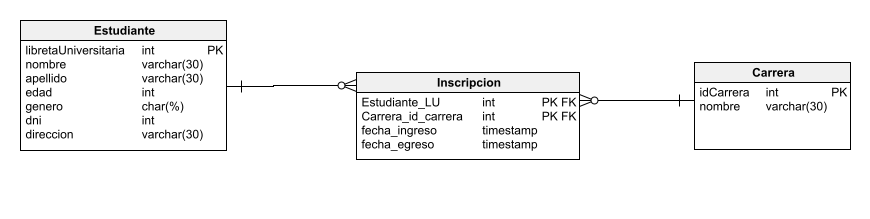

# Arquitectura Web - Ejercicios Integradores 
### Integrantes: 
<ul>
  <li>Diaz Bailey, Viviana Ayelen</li>
  <li>Lopardo, Martin Ignacio</li>
  <li>Peña, Beltran</li>
  <li>Fernandez, Ezequiel</li>
</ul>

### TP1-Entregable
#### Fecha de entrega: Miércoles, 28 de septiembre de 2022, 14:00

### Enunciado
##### Considere el siguiente diagrama de base de datos:

1. Cree un programa utilizando JDBC que cree el esquema de la base de datos.
2. Considere los CSV dados y escriba un programa JDBC que cargue los datos a la base de
datos. Considere utilizar la biblioteca Apache Commons CSV, disponible en Maven central,
para leer los archivos:  
<i>CSVParser parser = CSVFormat.DEFAULT.withHeader().parse(new
FileReader("productos.csv")); 
for(CSVRecord row: parser) {
System.out.println(row.get("idProducto"));
System.out.println(row.get("nombre"));
System.out.println(row.get("valor"));
} </i>
3. Escriba un programa JDBC que retorne el producto que más recaudó. Se define
“recaudación” como cantidad de productos vendidos multiplicado por su valor.
4. Escriba un programa JDBC que imprima una lista de clientes, ordenada por a cuál se le
facturó más

---

### TP2-Entregable
#### Fecha de entrega: Miércoles, 5 de octubre de 2022, 14:00

### Enunciado

1. Considere el diseño de un registro de estudiantes, con la siguiente información: nombres,
apellido, edad, género, número de documento, ciudad de residencia, número de libreta
universitaria, carrera(s) en la que está inscripto, antigüedad en cada una de esas carreras, y
si se graduó o no. Diseñar el diagrama de objetos y el diagrama DER correspondiente.
2. Implementar consultas para:

    a. dar de alta un estudiante
  
    b. matricular un estudiante en una carrera
  
    c. recuperar todos los estudiantes, y especificar algún criterio de ordenamiento simple.
    
    d. recuperar un estudiante, en base a su número de libreta universitaria.
    
    e. recuperar todos los estudiantes, en base a su género.
    
    f. recuperar las carreras con estudiantes inscriptos, y ordenar por cantidad de inscriptos.
    
    g. recuperar los estudiantes de una determinada carrera, filtrado por ciudad de residencia.
    
3. Generar un reporte de las carreras, que para cada carrera incluya información de los
inscriptos y egresados por año. Se deben ordenar las carreras alfabéticamente, y presentar
los años de manera cronológica.

### El DER a utilizar es el siguiente:

